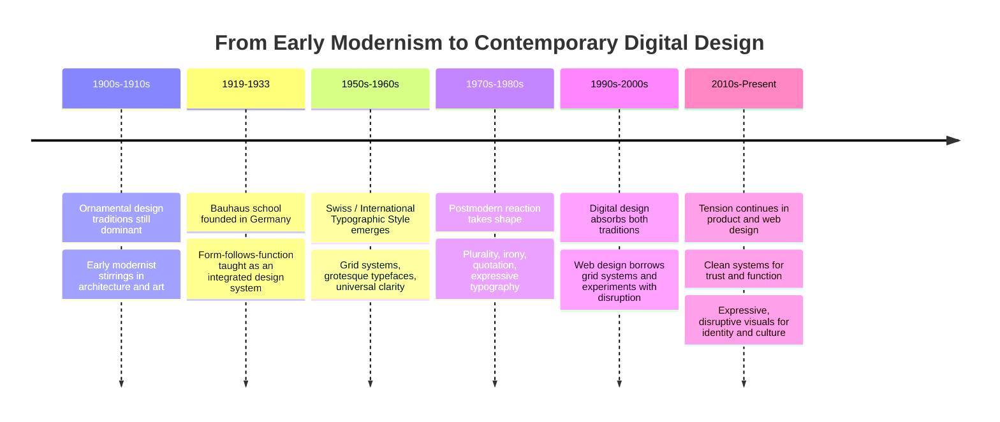

# Chapter 3: Design Language — How Visual Form Carries Meaning

## Design Is Never Neutral

Every design decision — a typeface, a grid, a color, the amount of white space around a headline — communicates something, whether or not the designer intended it to. A dense block of small text in a serif font reads differently from the same words set in a huge, loose sans-serif with lots of air around it, even though the *information* is identical. One might read as serious and institutional; the other as casual and confident.

This chapter traces where some of our most influential visual habits came from, why they were designed the way they were, and why designers have been arguing — productively — about the right way to communicate ever since.

## A Short Historical Path Into Modernism

Before the twentieth century, a lot of commercial and decorative design was ornamental: dense with pattern, historical reference, and embellishment. Industrialization changed the terms of the conversation. As mass production, new printing technology, and rapid urban growth reshaped daily life, a generation of designers, architects, and artists began asking a different question: **what should design look like in a world defined by machines, speed, and mass communication, rather than handcraft and aristocratic ornament?**

Out of that question came *modernism* — not a single style, but a shared instinct that design should be honest about its materials and its function, rather than disguising a mass-produced object as something hand-carved and precious. This instinct shows up across many early twentieth-century movements, but two threads matter most for understanding the visual language you still see everywhere today: the Bauhaus and the Swiss / International Typographic Style.

## Bauhaus: Form Follows Function, Taught as a System

The Bauhaus was a German school of art and design (active roughly 1919–1933) built on the idea that fine art, craft, and industrial production shouldn't be treated as separate disciplines. Students studied color theory, typography, and material experimentation side by side, with an underlying belief that good design should serve everyday life — not sit apart from it as decoration.

Key Bauhaus commitments that still echo today:

- **Function should shape form**, rather than form being applied on top of function as decoration.
- **Geometric simplicity** — circles, squares, triangles — treated as a visual vocabulary of honest, reducible shapes.
- **Integration of disciplines**: a chair, a poster, and a building could share the same underlying design logic.
- **Design for mass production**, not just unique handcrafted objects — meaning a design had to work when reproduced, not just as a singular artifact.

The Bauhaus didn't invent minimalism out of nowhere, but it gave the impulse toward geometric clarity a coherent teaching philosophy that would shape design education for the rest of the century.

## Swiss Style: Grid, Grotesque Type, and Universal Clarity

A few decades later, mid-twentieth-century Swiss designers developed what's usually called the **Swiss Style** or **International Typographic Style**. It took modernist instincts and turned them into a rigorous, almost mathematical system for organizing information.

Core principles of Swiss design:

- **The grid** — a strict underlying structure of columns and rows that every element aligns to, creating order and predictability across a page or a whole system of documents.
- **Sans-serif "grotesque" typefaces** (Helvetica being the most famous descendant of this tradition) chosen for their neutrality — letterforms that don't call attention to themselves with decorative flourishes.
- **Objectivity and universality** — the idea that clear, rational design could communicate across languages and cultures without relying on decoration or nostalgia.
- **Asymmetric but ordered layouts**, using visual hierarchy (size, weight, position) rather than ornament to show readers what matters most and in what order to read it.

The Swiss Style's ambition was almost utopian: if design could be reduced to its most rational, functional essentials, information could be communicated with near-mathematical clarity to anyone, anywhere.

## Modernist Principles, in Summary

Across Bauhaus and Swiss design, a shared set of principles emerges:

- **Grid** — an invisible structure that organizes content predictably.
- **Hierarchy** — using scale, weight, and placement to guide the eye in a clear order.
- **Clarity** — removing anything that doesn't help the reader understand.
- **Reduction** — stripping ornament down to essential geometric and typographic form.
- **Function** — letting the purpose of the object or message determine its form, not the other way around.

These principles didn't just shape posters and buildings — they became the underlying operating system for a huge amount of institutional design: transit maps, corporate identity systems, wayfinding signage, and eventually a large share of digital interface design.

## The Postmodern Reaction

By the 1970s and 80s, a new generation of designers began pushing back — not necessarily rejecting modernism outright, but questioning its claim to be *neutral* or *universal*. Their critique, roughly: modernist clarity wasn't actually value-free. It was itself a style, with its own biases and blind spots, dressed up as pure rational function.

Postmodern design embraced:

- **Plurality** — many valid visual voices, instead of one "correct" rational system.
- **Irony** — designs that wink at their own artifice rather than pretending to be purely functional.
- **Disruption** — breaking the grid on purpose, letting elements collide, overlap, or feel unstable.
- **Quotation** — borrowing and remixing historical styles, ornament, and imagery that modernism had discarded.
- **Expressive typography** — type used as a visual, emotional, even chaotic element, not just a neutral vessel for words.

Where the Swiss Style asked "how do we communicate this as clearly and universally as possible?", postmodern design often asked "whose 'universal' is this, really — and what gets lost when we flatten everything into one rational system?"

## The Tension Didn't Resolve — It Kept Going

It's tempting to tell this as a story with an ending: modernism, then postmodernism, done. That's not accurate. What actually happened is that a set of underlying tensions got named, and design has kept oscillating around them ever since:

- **Order vs. disruption**
- **Universality vs. identity**
- **Clarity vs. expression**
- **Grid vs. anti-grid**
- **Restraint vs. abundance**
- **Function vs. irony**

You can see this tension live in contemporary digital design constantly. A banking app's interface leans hard toward Swiss-style clarity and restraint — grid-based layouts, neutral sans-serif type, minimal ornament — because trust and legibility matter more than personality. A streetwear brand's website might do the opposite: overlapping type, saturated color, deliberately "broken" grids, and glitchy or maximalist visual noise, because *disruption itself* is the message: "we don't play by institutional rules."

Even within a single product, both tendencies often coexist. A tech company's marketing site might use bold, playful, postmodern-leaning illustration and type in its hero section, then switch to a rigid Swiss-style grid the moment you enter the actual product dashboard, because the job of that dashboard is functional clarity, not personality. The tension isn't a relic of the twentieth century — it's a live decision designers make on nearly every project.

## Comparing Modernist and Postmodern Instincts

| Dimension | Modernist Instinct | Postmodern Instinct |
|---|---|---|
| Structure | Strict grid | Broken, layered, or absent grid |
| Typeface choice | Neutral sans-serif (grotesque) | Expressive, mixed, or historically referential type |
| Color | Restrained, often limited palette | Saturated, eclectic, or deliberately clashing |
| Claim to truth | Aims for universal clarity | Questions whether "universal" is really neutral |
| Attitude toward history | Breaks from ornamental past | Freely quotes and remixes past styles |
| Emotional register | Calm, rational, trustworthy | Playful, ironic, sometimes confrontational |
| Where it shows up today | Banking apps, wayfinding, enterprise software | Streetwear, music, youth culture brands, art direction |

## A Timeline of the Tension

## How to Read a Design

Next time you look at a poster, an app, or a website, try asking these questions before deciding whether you "like" it:

1. **Is there a grid, and is it being followed or broken?** Alignment (or the lack of it) is rarely accidental.
2. **What does the typeface choice imply?** A neutral grotesque sans-serif reads differently than a hand-drawn script or a historical serif.
3. **How much restraint or abundance is there?** Empty space communicates confidence and calm; density communicates energy, urgency, or abundance.
4. **Does the design want to feel universal, or does it want to feel specific to a subculture or identity?**
5. **Is the design being sincere about function, or is it winking at you — using irony, exaggeration, or self-aware artifice?**
6. **What historical style, if any, is being quoted or referenced — and why might the designer have reached for that reference?**

Asking these questions turns "I like this" or "I don't like this" into an actual analysis of what the design is doing and why.

## Museum Research

Reading about design movements is useful, but nothing replaces looking closely at real, physical or archival objects from credible institutional collections. Before you can talk confidently about Bauhaus or Swiss design, go look at actual primary sources.

Search terms and institutions to start with — verify the specific objects and details yourself, since this chapter does not cite or describe any actual museum holdings:

- **The Metropolitan Museum of Art** — search their collection database for "Bauhaus" or "modernist design"
- **MoMA (Museum of Modern Art)** — search "Bauhaus," "Swiss graphic design," or "International Typographic Style" in their online collection
- **Cooper Hewitt, Smithsonian Design Museum** — search "Bauhaus typography" or "modernist graphic design"
- **The V&A (Victoria and Albert Museum)** — search "Bauhaus" or "postmodern design" in their collections
- **Bauhaus-Archiv / Museum für Gestaltung** — dedicated archival collections of original Bauhaus student work and teaching materials
- **Museum für Gestaltung Zürich** — strong holdings related to Swiss graphic design history

When you find objects, look closely at grid structure, type choice, use of space, and color — and compare what you see against the principles described in this chapter. Do the objects match the textbook description, or do they complicate it? Primary sources are usually messier and more interesting than the tidy historical narrative.

## Back to the T-Shirt: Modernist vs. Postmodern Presentation

Take the same plain white T-shirt one more time.

**Modernist presentation:** A single product photo, centered, on a plain white or light-gray background. Grid-aligned product information in a neutral sans-serif type: fabric weight in grams, fit measurements, care instructions, price — nothing more. Generous white space. The design communicates confidence through restraint: *this product doesn't need decoration to prove its value.*

**Postmodern presentation:** The same shirt shown at an odd angle, maybe torn from a magazine-collage-style layout, overlapping hand-drawn typography and stickers, a clashing color background, ironic copy like "just a shirt (we promise)." The design communicates personality and self-awareness: *we know this is "just" a T-shirt, and we're having fun with that instead of pretending otherwise.*

Same cotton. Same stitching. Two completely different relationships with the viewer — one built on trust through clarity, the other on connection through irony and personality. Neither approach is "more correct." They're doing different jobs for different audiences.

## What You Should Remember

- Design is never a neutral container for information — every formal choice (grid, type, color, space) communicates meaning.
- Modernism, taught systematically through the Bauhaus and refined by the Swiss / International Typographic Style, prized grid, hierarchy, clarity, reduction, and function.
- Postmodern design reacted against modernism's claim to neutrality and universality, embracing plurality, irony, disruption, quotation, and expressive typography.
- This isn't a closed historical story — the same tensions (order vs. disruption, universality vs. identity, clarity vs. expression, grid vs. anti-grid, restraint vs. abundance, function vs. irony) are alive in contemporary web and product design today.
- Reading a design well means asking what its grid, type, space, and historical references are doing — not just whether you like it.
- Primary-source research in real museum and institutional collections (The Met, MoMA, Cooper Hewitt, the V&A, Bauhaus and Swiss design archives) will teach you more than any single textbook summary, including this one.
- The plain white T-shirt can be presented in a modernist register (calm, restrained, trust through clarity) or a postmodern register (playful, ironic, personality through disruption) without changing the product at all.
