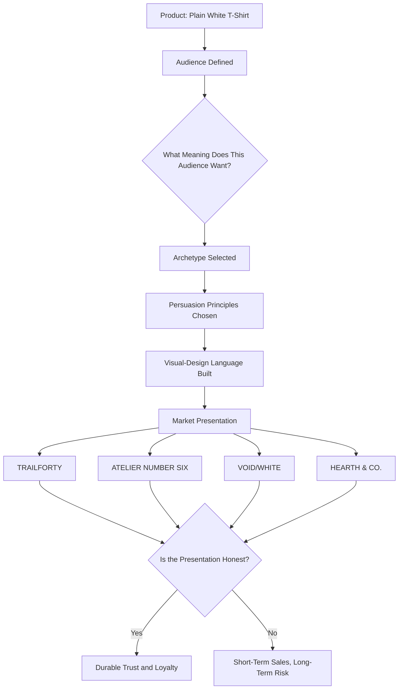

# Chapter 4: The White T-Shirt Case Study

## One Shirt, Four Businesses

By now you've watched this shirt get framed for a bargain hunter, dressed up in a musician's photo, and marked "only 2 left." You've seen it wear the Explorer's boots and the Sage's reading glasses. You've watched it sit in a Swiss grid and then get torn apart by a postmodern collage.

This chapter is where we stop sampling ideas one at a time and build four complete, coherent product concepts — each one a small, fictional business, each one selling the *exact same physical shirt*, and each one asking you to buy something almost entirely different. Same cotton. Same seams. Same tag size. Totally different reason to reach for your wallet.

Think of this chapter as a design studio crit. Four teams were given an identical white T-shirt and told "make it a business." Here's what they came back with.

---

## Concept 1: TRAILFORTY — "Wear It Until the World Runs Out of Trails"

**Target Audience:** College students and young adults who see themselves as active, outdoorsy, or aspirationally adventurous — even if most of their "adventure" happens on weekend hikes and spring break trips rather than actual expeditions.

**Brand Archetype:** Explorer. The core promise is freedom, discovery, and a shirt that's ready for wherever you end up.

**Persuasion Principles at Work:**
- *Authority* — technical language about moisture-wicking weave and UV resistance, borrowed from performance-gear credibility.
- *Social Proof* — user-submitted photos of the shirt at trailheads, campsites, and airport gates.
- *Unity* — copy that speaks to a shared identity ("for people who'd rather ask forgiveness than permission from their itinerary").

**Visual Language:** Warm, sun-bleached photography; topographic-line graphics as subtle background texture; a slightly worn, rugged sans-serif typeface; earth-tone accents against the shirt's white.

**Headline:** *"One Shirt. Every Trailhead."*

**Short Product Story:** TrailForty started, the story goes, when two friends realized they'd worn the same cotton shirt on forty different trips across three continents, and it never let them down. The brand isn't selling a shirt for the outdoors — it's selling *proof of a life spent outdoors*, one shirt at a time.

**Likely Imagery:** A person adjusting a backpack strap mid-trail, shirt visibly worn-in but not dirty; a wide shot of the shirt drying on a tent line at golden hour; a close crop of sun-weathered fabric next to a worn passport.

**What the Customer Is Actually Buying:** Not moisture-wicking performance (it's cotton — it doesn't wick particularly well). They're buying an identity marker: *I am someone who goes places.*

**Ethical Risk / Limitation:** The "performance" language implies technical capability the fabric doesn't really have. If TrailForty leans too hard on implying this cotton shirt performs like technical synthetic gear, it drifts from honest archetype-storytelling into a misleading product claim — the line Chapter 1 warned about.

---

## Concept 2: ATELIER NUMBER SIX — "Considered. Correct. Complete."

**Target Audience:** Design-conscious professionals and students who value restraint, craftsmanship, and quiet confidence over visible logos or trend-chasing.

**Brand Archetype:** Sage, with a strong secondary note of Ruler (control, order, quality as authority).

**Persuasion Principles at Work:**
- *Authority* — exhaustive, almost clinical specification of fabric weight (grams per square meter), thread count, and country of origin.
- *Consistency/Commitment* — customers are invited to build a "capsule wardrobe," making each future purchase feel like a continuation of a considered system rather than an impulse buy.
- *Logos (rhetorical appeal)* — the entire brand voice argues through specification and reasoning rather than emotion.

**Visual Language:** Strict grid-based layout; a single neutral grotesque sans-serif typeface; generous white space; a muted, restrained palette of white, gray, and black; product photography lit flat and even, with no lifestyle staging at all — just the object.

**Headline:** *"The Only White T-Shirt You'll Need to Read the Spec Sheet For."*

**Short Product Story:** Atelier Number Six doesn't tell a founder's origin story. It tells a fabric story: where the cotton was grown, how it was woven, why the seam allowance is 1.2 centimeters and not 1.5. The brand's entire pitch is that most T-shirts are made from decisions nobody bothered to explain — and this one isn't.

**Likely Imagery:** The shirt photographed flat, centered, against a seamless white or light-gray background; a macro shot of the stitch line; a small diagram-style graphic showing the fabric's weave structure.

**What the Customer Is Actually Buying:** Confidence that they made a *reasoned* decision, not an emotional one — even though the emotional payoff (feeling smart, feeling in control) is exactly what's being sold.

**Ethical Risk / Limitation:** Precision and specification can be used to manufacture false authority. If the specs are real and verifiable, this is honest Sage-branding. If a brand invents pseudo-technical detail to *sound* authoritative without real substance behind it, it's borrowing the credibility of expertise without earning it — authority-as-manipulation.

---

## Concept 3: VOID/WHITE — "It's Just a Shirt. Relax."

**Target Audience:** Younger, culturally plugged-in shoppers — often students — who are fatigued by branding itself and are drawn to things that seem to mock or subvert traditional advertising.

**Brand Archetype:** Rebel, with a wink of Jester.

**Persuasion Principles at Work:**
- *Liking* — the brand voice is self-deprecating and funny, building rapport by refusing to take itself seriously.
- *Scarcity* (used ironically) — "Limited drop of unlimited cotton" pokes fun at scarcity marketing while still technically using it.
- *Reciprocity* — the brand gives away its own manifesto and design process for free online, building goodwill before ever asking for a sale.

**Visual Language:** Deliberately broken grid; type set at odd angles and overlapping; a collage aesthetic mixing scanned paper textures, hand-drawn marks, and glitchy digital artifacts; loud color used sparingly against a stark black-and-white base, almost like graffiti on a gallery wall.

**Headline:** *"We Made a Plain Shirt. You Can Stop Reading Now."*

**Short Product Story:** VOID/WHITE's entire premise is a joke that's also completely sincere: every brand insists their basic T-shirt is revolutionary, so VOID/WHITE decided to be the one brand honest enough to say "it's cotton, it's white, we didn't reinvent anything." The irony is the hook. Buying it feels like being in on a joke that most advertising refuses to admit.

**Likely Imagery:** The shirt crumpled in a laundry basket instead of styled; a screenshot-style graphic mocking typical product marketing copy with it crossed out; type-heavy graphic panels that look more like a zine than an ad.

**What the Customer Is Actually Buying:** Belonging to an in-group that considers itself too smart for conventional marketing — which is, itself, a very conventional marketing move, just wearing a different costume.

**Ethical Risk / Limitation:** Irony can function as a shield against real accountability. A brand that markets itself as "honest" and "anti-marketing" is still marketing — and if its supply chain, pricing, or labor practices don't match the winking, down-to-earth persona, the irony becomes a smokescreen rather than genuine transparency.

---

## Concept 4: HEARTH & CO. — "Something Soft to Come Home To"

**Target Audience:** Parents, caregivers, and anyone shopping for comfort-focused basics — often buying for family members as much as for themselves.

**Brand Archetype:** Caregiver.

**Persuasion Principles at Work:**
- *Pathos (rhetorical appeal)* — warm, emotionally resonant language centered on comfort, home, and care for loved ones.
- *Social Proof* — testimonials framed around family life ("the shirt my kid actually wants to wear") rather than individual achievement.
- *Reciprocity* — a portion of proceeds framed as going toward a community clothing-donation program, inviting customers to feel their purchase is also a small act of care extended outward.

**Visual Language:** Soft, warm-toned photography; rounded, friendly typography; muted pastel accents against the shirt's white; imagery of home interiors — a sunlit kitchen table, a laundry line, a worn-in armchair.

**Headline:** *"The Shirt That Feels Like Being Taken Care Of."*

**Short Product Story:** Hearth & Co. doesn't talk about performance fabric or fashion statements. It talks about softness, gentleness on skin, and the quiet comfort of a well-worn favorite shirt at the end of a long day. It's selling ease, not achievement.

**Likely Imagery:** A shirt folded neatly on a stack of clean laundry; a close-up of soft fabric texture; a family member handing the shirt to another, framed warmly rather than aspirationally.

**What the Customer Is Actually Buying:** A feeling of nurturing — either being nurtured themselves, or extending care to someone they love, through the simple act of choosing a comfortable, gentle product.

**Ethical Risk / Limitation:** Caregiver branding can quietly exploit real anxiety — particularly parental anxiety about providing "the best" for a child. If comfort claims ("gentlest on sensitive skin") aren't substantiated, the brand is using genuine care instincts as leverage rather than honestly earning trust.

---

## Synthesis Table: Four Shirts, Four Worlds

| | TRAILFORTY | ATELIER NUMBER SIX | VOID/WHITE | HEARTH & CO. |
|---|---|---|---|---|
| **Audience** | Aspirational outdoors-minded students | Design-conscious professionals | Marketing-fatigued young shoppers | Parents and caregivers |
| **Archetype** | Explorer | Sage (+ Ruler) | Rebel (+ Jester) | Caregiver |
| **Core Persuasion Principles** | Authority, Social Proof, Unity | Authority, Consistency, Logos | Liking, Ironic Scarcity, Reciprocity | Pathos, Social Proof, Reciprocity |
| **Design Language** | Warm, rugged, lifestyle photography | Swiss-influenced grid, restrained, neutral | Postmodern collage, broken grid, ironic | Soft, warm, home-centered |
| **Headline** | "One Shirt. Every Trailhead." | "Considered. Correct. Complete." | "We Made a Plain Shirt. You Can Stop Reading Now." | "The Shirt That Feels Like Being Taken Care Of." |
| **What's Really Being Sold** | Identity as an adventurer | Confidence in a reasoned choice | Belonging to a savvy in-group | The feeling of being cared for |
| **Main Ethical Risk** | Overstating technical performance | Manufacturing false technical authority | Irony masking real accountability gaps | Exploiting care-based anxiety |

## How It All Comes Together

Every one of these four brands started from the exact same node at the top of the diagram: a plain white T-shirt. Everything that makes them feel like different products — the audience, the archetype, the persuasion, the visual language — was *constructed*, not discovered. That's not a criticism. Construction is what branding and design are for. The only question that matters, every time, is the one at the bottom of the diagram: is the construction honest enough to survive the customer looking closely at it?

## What You Should Remember

- The same physical product can support radically different, fully coherent brand identities, built by combining a specific audience, archetype, persuasion strategy, and visual-design language.
- TRAILFORTY (Explorer), ATELIER NUMBER SIX (Sage, Swiss-influenced modernist design), VOID/WHITE (Rebel, postmodern disruptive design), and HEARTH & CO. (Caregiver) show four coherent, distinct approaches to one identical shirt.
- Every element from earlier chapters — persuasion principles, archetype, and visual-design language — works together as a single system, not as separate, unrelated toolkits.
- Every concept, no matter how appealing, carries its own specific ethical risk: overclaiming performance, manufacturing false authority, using irony to dodge accountability, or exploiting caregiving anxiety.
- The test that matters most, across every concept, is the same one from Chapter 1: would this brand's story survive the customer understanding exactly how it was built?
