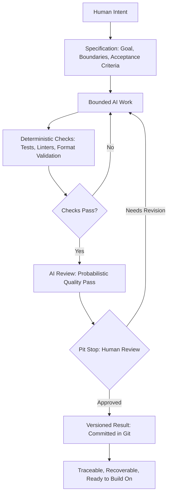

# Chapter 5: Synthesis — From Persuasion to Direction

## Three Lenses, One Underlying Skill

Across the last four chapters you've been building one skill wearing three different hats: the ability to *deliberately shape meaning* — and to do it honestly. It's worth naming the underlying pattern before we take it somewhere new.

- **Persuasion** helps answer: *what response are we trying to enable in the audience?* (Attention, belief, trust, action.)
- **Archetype** helps answer: *what meaning or identity are we expressing?* (Explorer, Sage, Rebel, Caregiver, and so on.)
- **Design language** helps answer: *how should that meaning look and feel?* (Grid or collage, restraint or abundance, clarity or irony.)

Put together, these three lenses form a simple but powerful sequence: decide what response you want, decide what meaning produces that response, decide what visual and verbal form expresses that meaning. The white T-shirt case study in Chapter 4 was really just this sequence run four separate times on the same physical object.

Here's the useful surprise: this sequence isn't just a framework for T-shirts, posters, or brand identities. It's a framework for **giving direction to anyone or anything you're delegating creative or technical work to** — including, increasingly, AI systems.

## Why This Framework Applies to Directing AI

When you ask an AI assistant to write copy, design an interface, draft a plan, or generate code, you are — whether you realize it or not — making the same three decisions:

1. **What response are we trying to enable?** (What should the output accomplish, and for whom?)
2. **What meaning or identity should this carry?** (What "character" should the output have — formal, playful, minimal, bold?)
3. **What form should that take?** (What structure, style, and constraints should shape the actual output?)

A vague instruction like "write something persuasive" skips all three questions and leaves the AI to guess. A well-directed instruction — "write copy for a Caregiver-archetype brand, using warm pathos-driven language, in a soft and restrained visual-design register, aimed at parents shopping for comfort basics" — answers all three questions explicitly. The quality gap between those two instructions is enormous, and it's the exact gap this book has been teaching you to close.

But directing AI well requires one more layer that pure creative direction doesn't always need: **you have to bound the work, check it, and remain responsible for it.** That's the rest of this chapter.

## Specification: Giving the Work a Boundary

A **specification** is a clear, explicit description of what a task should produce, and — just as importantly — what it should *not* do. Think of it as the technical cousin of the persuasion/archetype/design-language sequence: instead of just describing tone and meaning, a specification also describes scope, constraints, required inputs, and acceptance criteria (notice — this very chapter was built from a specification much like the ones described here).

Why does a specification matter so much when AI is involved? Because AI systems are extremely good at producing *something* confidently, whether or not that something is actually what you needed. An unbounded request ("make the app better") invites the AI to guess at scope, invent requirements you never intended, and drift away from what you actually wanted. A bounded request ("add input validation to the signup form so that empty and malformed emails are rejected, without changing any other form behavior") gives the AI — and any human reviewing the AI's work — a clear target and a clear edge past which changes are out of scope.

A good specification typically includes:

- The **goal** — what outcome the work should achieve.
- The **boundaries** — what's explicitly out of scope.
- The **acceptance criteria** — how you (or an automated check) will know the work succeeded.

## Version Control: Why Git Matters More, Not Less, When AI Is Involved

**Git** (and version control systems like it) record every change to a project as a discrete, traceable snapshot. This matters for any collaborative work, but it becomes essential once AI is doing some of the generating, for a few concrete reasons:

- **Traceability.** When something breaks or looks wrong, version history lets you see exactly what changed, when, and — if commit messages are written well — why. Without this, debugging AI-generated work becomes guesswork.
- **Recovery.** AI-assisted work can move fast, which means mistakes can also compound fast. Version control means a bad change is never a catastrophe — you can revert to the last known-good state.
- **Review boundaries.** Git naturally creates discrete units of change (commits, branches, pull requests) that map well onto the "bounded task" idea above. Each unit becomes a natural point to run checks and invite human review, rather than reviewing one enormous, tangled block of changes after the fact.

In short: specifications bound *what* the AI should do; version control preserves *a trustworthy record* of what it actually did, and gives you a safety net if it did the wrong thing.

## Deterministic Checks: Cheap, Repeatable, and Limited

A **deterministic check** is an automated test that produces the same result every time given the same input — a test suite that passes or fails, a linter that flags a syntax error, a script that confirms a file matches an expected format. These checks are extremely valuable because they're:

- **Cheap to run repeatedly** — you can run them after every single change, constantly, at almost no cost.
- **Objective** — there's no ambiguity about a pass/fail result.
- **Fast** — they can catch obvious problems in seconds, long before a human ever needs to look.

But deterministic checks have a hard ceiling: they can only catch what they were explicitly built to catch. A test suite can confirm that a function returns the correct output for the inputs it was tested against — it cannot tell you whether the underlying approach was wise, whether the tone of a piece of writing is appropriate, or whether a claim is actually true. For that, you need something else.

## Probabilistic Review: Useful, But Not Certain

AI systems — including the one you might be using to review other AI-generated work — are excellent at a kind of review deterministic checks can't do: reading something and giving a qualitative judgment about tone, clarity, plausibility, or apparent correctness. This is genuinely useful. But it's **probabilistic**, not deterministic: the same input can occasionally produce different judgments, and a confident-sounding review is not proof of accuracy. AI review can catch things a rigid test suite would miss, but it can also miss things, or be confidently wrong, in ways that are harder to detect than a simple failed test.

The practical implication: use AI review as an additional layer of scrutiny, not as a replacement for deterministic checks *or* for human judgment. It's a second pass, not a verdict.

## Human Judgment: The Layer That Doesn't Get Automated Away

This is the core claim of the whole chapter: **no matter how good specifications, deterministic checks, and AI review get, humans remain responsible for judgment, meaning, truthfulness, context, and final decisions.**

Why can't this layer be automated away?

- **Judgment** requires weighing trade-offs the specification didn't anticipate — the kind of contextual weighing this book has been practicing since Chapter 1's questions about honest persuasion.
- **Meaning** requires knowing what actually matters to the actual audience, in the actual cultural and situational context — the exact thing Chapter 2 warned archetypes can get wrong if applied thoughtlessly.
- **Truthfulness** requires someone accountable for verifying that claims are accurate, sources are real, and nothing was fabricated to fill a gap — checks and AI review can flag inconsistency, but a human has to actually care about truth.
- **Context** requires understanding things outside the immediate task: organizational history, legal exposure, relationships, timing — context a specification usually can't fully capture.
- **Final decisions** require someone who can be held accountable for the outcome — automated systems don't bear responsibility the way a person does.

### The Pit-Stop Metaphor

Think about a race car during a long race. It doesn't stop constantly — that would defeat the purpose of racing. It runs at full speed for long stretches, trusting its engineering and its automated instrumentation. But at *deliberately chosen moments* — a scheduled pit stop, a warning light, a lap where something felt slightly off — it comes in for close, deliberate human inspection: tires checked, fuel verified, small adjustments made by people who understand the whole car and the whole race, not just the instrument readings.

AI-assisted work should run the same way. Automation — deterministic checks, AI review — keeps things moving quickly and catches a lot on its own, lap after lap, without needing a human to watch every second. But certain moments deserve a deliberate human pit stop: before something ships publicly, before a claim gets published, before a decision has consequences that are hard to reverse, or whenever the automated signals disagree with each other. The goal isn't to slow everything down with constant manual review — it's to know exactly which moments are worth pulling into the pits for.

## The Complete Workflow

Notice that the human doesn't disappear at the end of this loop — they appear twice: once at the very start, setting intent and boundaries, and once at the pit stop, exercising judgment that no automated layer can fully substitute for. Everything in between is designed to make that human's attention more efficient, not to remove it.

## Bringing It All the Way Back

The plain white T-shirt from Chapter 1 and the specification-driven AI workflow from this chapter are more connected than they might look. In both cases, the raw material — cotton, or a language model's raw capability — is nearly meaningless without deliberate direction. In both cases, the honest version of the process survives being fully understood by the people it affects: a customer, a teammate, a user reading AI-assisted work. And in both cases, the person doing the directing remains responsible for whether the result is truthful, appropriate, and genuinely useful — not just persuasive, not just well-designed, but *right*.

## Questions for Next Week

1. Pick something you've recently asked an AI tool to help with. Did you give it a specification, or an unbounded request? What would a bounded version have looked like?
2. Think of a brand you interact with regularly. Which archetype does it seem to be using, and does its actual behavior match the identity it projects?
3. Find one example of a deterministic check you rely on in everyday life (a spell-checker, a form validator, a fact-checking habit). What does it catch well, and what does it clearly miss?
4. Describe, in your own words, one moment in a creative or technical project where you'd insist on a human "pit stop," even if everything automated said the work was fine.
5. Revisit one of the four T-shirt concepts from Chapter 4. If you had to direct an AI assistant to generate marketing copy for it, what would your specification say?

## What You Should Remember

- Persuasion, archetype, and design language form one coherent sequence: decide the response you want, decide the meaning that produces it, decide the form that expresses that meaning.
- This same sequence is useful for directing AI-assisted work, not just traditional creative work — vague requests produce vague, ungrounded results.
- A specification bounds AI work with a clear goal, explicit boundaries, and acceptance criteria, preventing scope drift and guesswork.
- Version control (like Git) provides traceability and recovery, turning AI-assisted mistakes into reversible events rather than catastrophes.
- Deterministic checks are cheap, fast, and objective, but limited to exactly what they were built to test.
- AI review adds a useful probabilistic layer of judgment, but it isn't certainty and shouldn't be mistaken for it.
- Humans remain responsible for judgment, meaning, truthfulness, context, and final decisions — the pit-stop moments that automation alone cannot replace.
